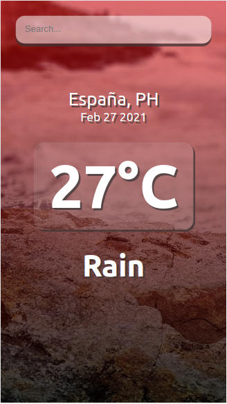
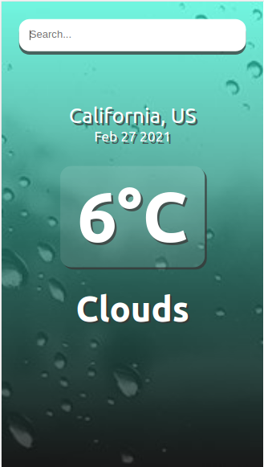

# React Weather App
Registrarse en https://openweathermap.org/ y obtener las claves API.

## Es necesario:

- https://nodejs.org/es/
- https://code.visualstudio.com/ (optativo)

- https://es.reactjs.org/

### `Inicio`

- **git clone https://github.com/rosarioconde/weather-app.git**
- **npm install**
- **npm start**

